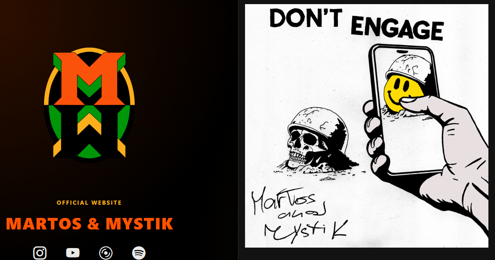

# Martos & Mystik Website

Responsive multilingual website developed for Martos & Mystik, a Catalan-Czech music duo blending reggae, dub, digital riddims, vocals and violin.

---

# Live Website

https://alejandroarevaloprogrammer.github.io/martos-and-mystik-web/

---

# Preview

---

# Overview

This project was developed as the official website for Martos & Mystik, with a focus on presenting their music, releases and visual identity through a clean and responsive front-end experience.

The website includes multilingual support, a dynamically rendered discography, integrated Bandcamp players and responsive navigation across desktop, tablet and mobile devices.

---

# Features

- Responsive single-page design
- English, Spanish and Catalan language support
- Dynamic discography rendered with JavaScript
- Singles and album track organization
- Bandcamp player integration
- Responsive mobile navigation
- Automatic menu closing behavior
- Scroll-to-top functionality
- EmailJS contact form integration
- SEO optimized metadata
- Open Graph and Twitter Card support
- XML sitemap and robots.txt
- Responsive favicons and web app manifest

---

# Technologies Used

- HTML5
- CSS3
- JavaScript
- Bootstrap 5
- Bootstrap Icons
- EmailJS

---

# Local Development

Use VSCode Live Server:

1. Open the project folder in VSCode
2. Right click `index.html`
3. Select `Open with Live Server`

---

# Deployment

The project is deployed using GitHub Pages.

Main URL:

https://alejandroarevaloprogrammer.github.io/martos-and-mystik-web/

---

# What I Learned

While developing this project, I improved my understanding of multilingual front-end development, responsive layouts and dynamic content rendering with JavaScript.

I also worked on organizing structured discography data, integrating external music players, improving mobile navigation and implementing SEO and social sharing metadata.

---

# Author

Created by Alejandro Arevalo Rojas.

GitHub:  
https://github.com/alejandroarevaloprogrammer

Portfolio:  
https://alejandroarevalorojas.com/

---

# License

This repository is publicly available for portfolio and reference purposes only.

The source code is not licensed for reuse, redistribution or commercial use without permission.

All music, artwork, photographs, logos and other media related to Martos & Mystik are the property of their respective owners and may not be reused, reproduced or redistributed without permission.
